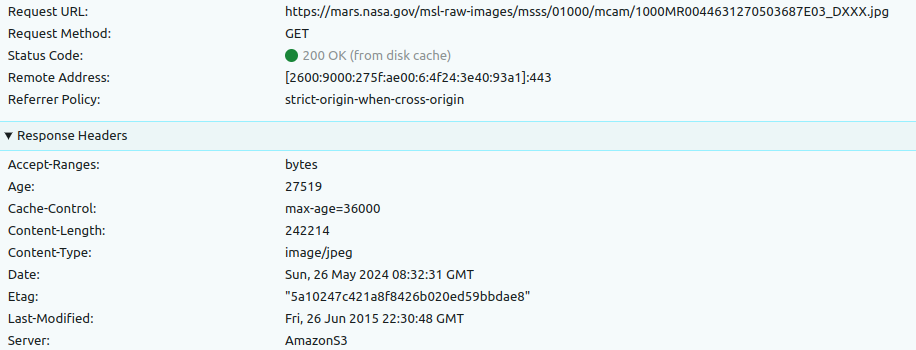
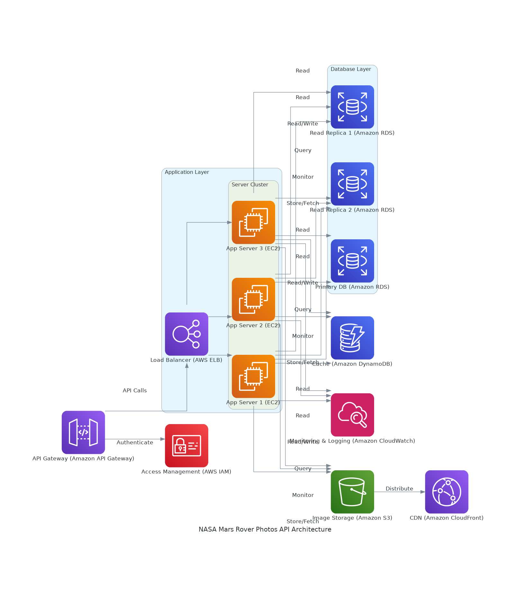

# Nasa Mars Rover Photos System Design

I created the above system diagram using draw.io. Following is a brief discussion of the above system diagram.

### Single Server vs Multi Server
Since it is a public API. I would be suitable to have *horizontal scaling* as compared to *vertical scaling*, because *vertical scaling* has its limit to the resource that can be added to a single server.

### Load Balancer
The load balancer evenly distributes the incoming traffic among the web servers. Even if one server goes down the traffic will be distributed among other servers. Another server will be added to the server pool.

### Multiple Databases
Same as having multiple servers, it is also a good idea to have multiple databases to have better availablity.

### Cache
We can store the results of frequently accessed data or results of expensive responses to the cache. If the user requests a resource that is present in the cache, it is retreived from the cache rather than sending a request to th server. Therefore, reducing the network requests.

### CDN
CDN is a network of geographically dispered servers that are used to deliver static content. In our case the images can be stored in the CDN. If a user requests an image, if it is not present in the CDN cache, the CDN server requests the file from the origin and saves it for the future requests.

### Data Center
In case of an event of data center outage, the whole system will go offline, therefore, it is a good idea to have multiple data centers. In this case the traffice will be directed to the healthy data center.

### Logging, Metrics, Automation, Monitoring

*Logging:* When an applcation grows, it is highly advisable to monitor error logs to identify errors and problems in the system. Tools can be used to aggregate them for better searching and viewing.

*Metrics and Monitoring:* Collecting different metics to help understand the business insights e.g. daily active users, user retension, revenue etc.

*Automation:* When a system gets bug and complicated, it is a good a idea to use automation tools to improve productivity, rather than deplying the new features manually.

## Choice of Databse
Observing the API response, the resposne appears to have the joins as well, therefore, a relational database would be fitting. For example PostgreSQL, MySQL etc.

## Add-ons

While fetching the photos from the API, I noticed that the API uses Amazons S3 service for storing the photos. Therefore, I came up with the idea to create the above system diagram using the services only from AWS. The following was generated using pythons `diagrams` package. `graphviz` is also requried along side pythons `diagrams` package.

`diagram.py` contains the code to generate the following system diagram using Amazon Web Services.

